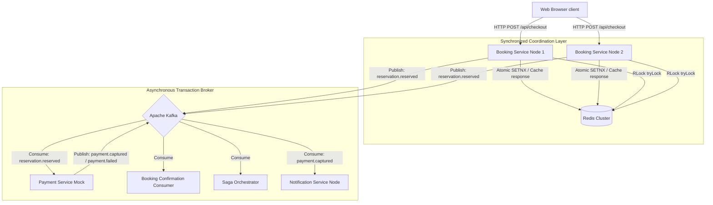

# Distributed Systems, Concurrency, and Synchronization Architecture | Tickify.co

This document describes the architectural specifications, concurrency handling, local multi-threading synchronization, and distributed transactional consistency patterns implemented in **Tickify.co**.

---

## 🏗️ 1. Distributed Systems Re-architecting

Tickify.co runs as a decoupled, multi-module distributed system designed to handle high transaction throughput under extreme contention (e.g., ticket booking rushes).



### Decoupled Core Services
- **Booking Service (`booking-service`)**: Owns the domain context for events, venues, seat maps, and initial checkout validation. Hosts the distributed idempotency filter and Redisson-based distributed lock services.
- **Notification Service (`notification-service`)**: Operates as an independent event-driven consumer, digesting transaction completions to trigger user messaging channels.
- **Common Module (`c-ticket-common`)**: Shared dependency housing payload DTOs, Kafka schemas, and serialization formats to eliminate code drift.

---

## 🧵 2. In-Memory Concurrency & JVM Multi-Threading

To manage concurrency safely within a single execution process (JVM node) and prevent thread racing when writing/reading state:

### Local Event Write Synchronization
- **Component**: [LocalEventLockRegistry.java](file:///e:/c-ticket/booking-service/src/main/java/com/ticketbooking/locking/LocalEventLockRegistry.java)
- **Mechanism**: Operates an in-memory lock table using `ConcurrentHashMap<UUID, ReentrantReadWriteLock>`.
- **Implementation**:
  ```java
  public <T> T write(UUID eventId, Supplier<T> action) {
      ReentrantReadWriteLock lock = eventLocks.computeIfAbsent(eventId, ignored -> new ReentrantReadWriteLock());
      lock.writeLock().lock();
      try {
          return action.get();
      } finally {
          lock.writeLock().unlock();
      }
  }
  ```
- **Thread Safety**: Guarantees that only one thread can execute write mutations (like state modifications or local collections updates) for a specific event at any given time. Other threads attempting to lock the same event will suspend execution, protecting against state corruption.

---

## 🔒 3. Distributed Locking & Synchronization

When scaled horizontally across multiple servers, JVM local synchronization is insufficient. We implement distributed mutual exclusion at the seat coordinate level.

### Redisson Distributed Locks
- **Component**: [DistributedSeatLockService.java](file:///e:/c-ticket/booking-service/src/main/java/com/ticketbooking/locking/DistributedSeatLockService.java)
- **Mechanism**: Uses **Redis** as a distributed lock manager via the **Redisson** framework, providing a thread-safe implementation of Java's `java.util.concurrent.locks.Lock` interface across distributed nodes.
- **Implementation Details**:
  - **Resource Keying**: `lockKey = "lock:event:" + eventId + ":seat:" + seatId`
  - **Lock Acquisition**:
    ```java
    acquired = lock.tryLock(0, leaseMs, TimeUnit.MILLISECONDS);
    ```
    - `waitTime = 0`: Threads attempting to book a highly contested seat do not wait (block). If the lock cannot be immediately acquired, the request fails fast, returning an HTTP `409 Conflict`.
    - `leaseTime = leaseMs (5 minutes)`: Solves the **split-brain / deadlock problem**. If a service node crashes while holding a lock, Redis automatically releases the key after the TTL expires.
    - **Reentrancy**: Redisson utilizes Lua scripts to manage lock state as a hash in Redis, supporting reentrant locking mechanics on the same thread/transaction.

---

## 🔄 4. Distributed Eventual Consistency (Saga Pattern)

Distributed systems cannot easily utilize traditional ACID transactions across network boundaries (due to latency, blocking locks, and 2PC performance penalties). Instead, the system implements an event-driven **Saga Choreography Pattern** over Kafka.

### Execution Path
1. **Acquire Local & Distributed Locks**: The booking node claims the seat using Redisson.
2. **Phase 1: Reserve**: Transitions seat status from `OPEN` to `RESERVED` (temporary hold) in the database. Releases Redisson lock.
3. **Phase 2: Event Emitting**: Emits a `reservation.reserved` event to Apache Kafka.
4. **Phase 3: Billing (Asynchronous Consumer)**: The billing worker consumes `reservation.reserved`. It simulates transaction verification.
   - If billing fails (e.g. insufficient funds), it publishes `payment.failed` to Kafka.
5. **Phase 4: Confirmation / Compensation**:
   - **Success (Confirm)**: If payment succeeds, `payment.captured` is published, prompting the `BookingConfirmationConsumer` to change the seat status to `CONFIRMED`.
   - **Failure (Compensating Rollback)**: If `payment.failed` is ingested, the orchestrator triggers a compensating rollback by publishing `seat.release.requested`. The `SeatReleaseConsumer` then rolls the database record back to `OPEN`, returning the system to a consistent state.

---

## 🛠️ 5. Distributed Idempotency (At-Least-Once Delivery Protection)

In distributed messaging and REST communication, network hiccups cause duplicate requests. To prevent duplicate seat charges, the system employs an idempotency engine.

### Idempotency Filter Specifications
- **Component**: [IdempotencyFilter.java](file:///e:/c-ticket/booking-service/src/main/java/com/ticketbooking/idempotency/IdempotencyFilter.java)
- **Keying**: `idem:checkout:{X-Retry-ID}` (Header-specified transaction token).
- **Synchronization Flow**:
  1. **Atomic Lock**: Calls Redis `setIfAbsent(key, "IN_FLIGHT", 2 minutes)`.
  2. **Concurrent Request Protection**: 
     - If the key is already `"IN_FLIGHT"`, any incoming duplicate thread pauses (`Thread.sleep(500)`) and polls once. 
     - If it remains `"IN_FLIGHT"`, the request is rejected with `409 Conflict`. This prevents race conditions where identical checkout payloads are processed concurrently.
  3. **Caching & Replay**:
     - Once processing succeeds, the HTTP status and cached JSON response payload are saved to Redis with a TTL.
     - Subscriptions or retries with the same `X-Retry-ID` immediately retrieve the cached response from Redis and replay it to the client, preventing duplicate execution of downstream billing and seat reservation logic.
     - On internal server errors (5xx), the key is deleted to allow the client to retry cleanly.

---

## 🚀 Environment Setup & Run Instructions

### 1. Spin up Core Infrastructure (Kafka, Zookeeper, Redis)
```bash
docker compose up -d
```

### 2. Maven Compile
```bash
# Windows
.\mvnw.cmd clean compile

# macOS/Linux
./mvnw clean compile
```

### 3. Run Microservices
**Booking Service (Port 8085)**:
```bash
# Windows
.\mvnw.cmd -pl booking-service spring-boot:run

# macOS/Linux
./mvnw -pl booking-service spring-boot:run
```

**Notification Service**:
```bash
# Windows
.\mvnw.cmd -pl notification-service spring-boot:run

# macOS/Linux
./mvnw -pl notification-service spring-boot:run
```
# Tickify.co

